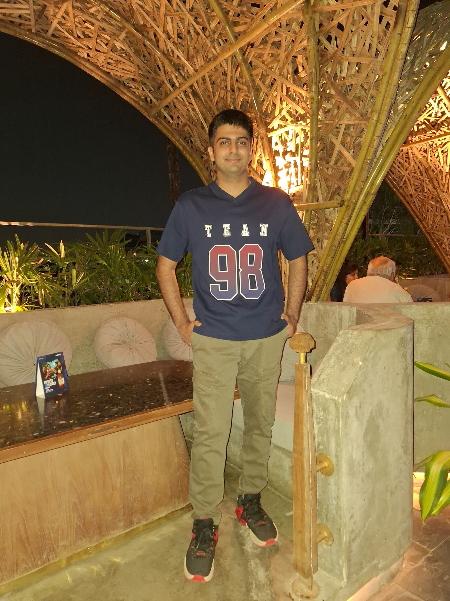
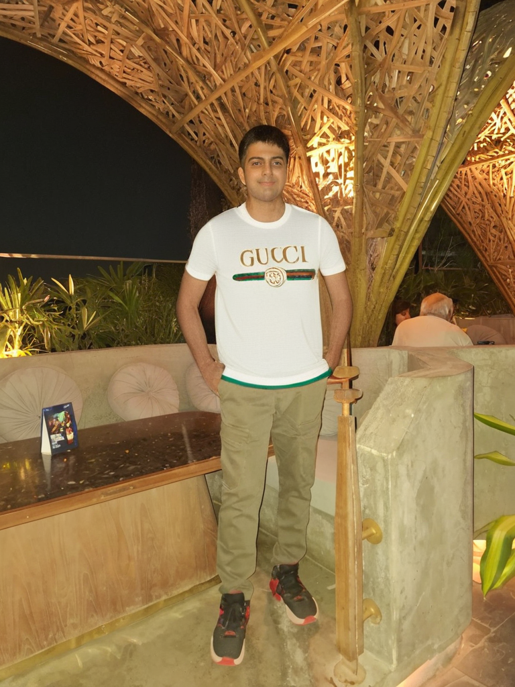
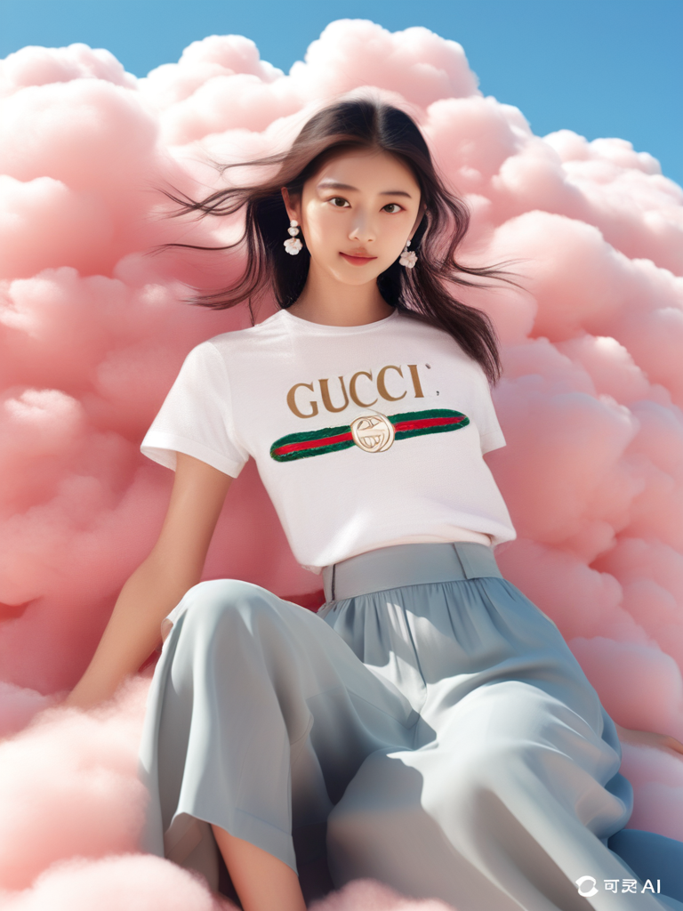
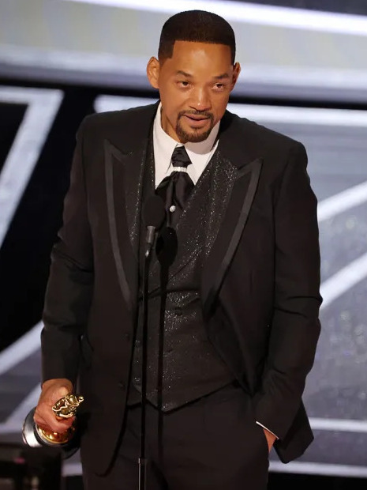
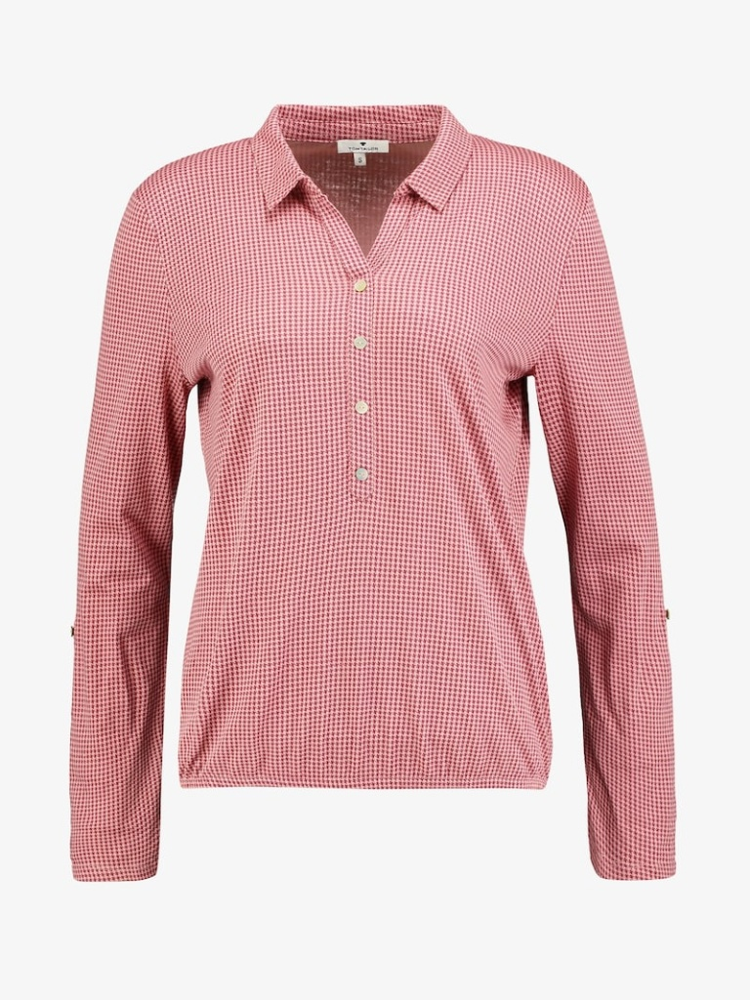

# IDM-VTON Virtual Try-On

A Python script for virtual try-on using the IDM-VTON (Improving Diffusion Models for Authentic Virtual Try-on in the Wild) model via Hugging Face Spaces API.

> 🚀 **Try on any garment on any person with AI-powered precision!**

## 🎭 Examples & Results

See the magic of AI-powered virtual try-on! Here are real results from our example images:

### Example Results Table

<table>
<tr>
<th width="25%">👤 Person</th>
<th width="25%">👕 Garment</th>
<th width="25%">✨ Result</th>
<th width="25%">📝 Description</th>
</tr>
<tr>
<td align="center">
 
<em>Arnav A.</em>
</td>
<td align="center">
 
<em>Gucci Upper</em>
</td>
<td align="center">
 
<em>Virtual Try-On</em>
</td>
<td>
<strong>Young Male + Luxury Garment</strong> 
Perfect fit demonstration with premium Gucci upper garment on young male subject
</td>
</tr>
<tr>
<td align="center">
 
<em>Korean Girl</em>
</td>
<td align="center">
 
<em>Gucci Upper</em>
</td>
<td align="center">
 
<em>Virtual Try-On</em>
</td>
<td>
<strong>Female + Clean Background</strong> 
Excellent garment transfer with clean background preservation and natural fitting
</td>
</tr>
<tr>
<td align="center">
 
<em>Will Smith</em>
</td>
<td align="center">
 
<em>Alternative Upper</em>
</td>
<td align="center">
⚡ <strong>Generate Now!</strong> 
<code>python run_examples.py</code> 
<em>Option 3</em>
</td>
<td>
<strong>Celebrity + Alternative Style</strong> 
Professional photo with alternative garment - perfect for formal wear demonstration
</td>
</tr>
</table>

